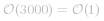

[TOC]

## Solution

---
#### Overview

This problem is practical, which can test one's basic knowledge about the data structure and algorithm.

First of all, let us clarify the problem a bit.
We are given a sequence of ping calls, _i.e._ *[t_1, t_2, t_3, ... t_n]*, ordered by the chronological order of their arrival time.

>Given the current ping call *t_i*, we are asked to count the number of previous calls that fall in the range of ![\[t_i-3000,\spacet_i\] ](./p___t_i_-_3000,_space_t_i__.png) .

Voila. This is how we can reformulate the problem with the basic data structure such as Array.
Note, the sequence of calls is ever-increasing, and we are given the call **one at a time**.

By the way, we also have a dedicated Explore card called [Array 101](https://leetcode.com/explore/learn/card/fun-with-arrays/) where one can review the characteristics and operations about Array.
In addition, one will also discover many interesting problems that can be solved with Array.


---
#### Approach 1: Iteration over Sliding Window

**Intuition**

Now that we've clarified the nature of the problem, it shall not be difficult to come up with a solution.
In fact, the solution is as simple as iterating through an array or a list.

>The idea is that we can use a container such as **array** or **list** to keep track of all the incoming ping calls. At each occasion of `ping(t)` call, first we append the call to the container, and then starting from the current call, we **iterate backwards** to count the calls that fall into the time range of `[t-3000, t]`.

Before rushing to the implementation, let us dwell on the problem a bit more, since there are still plenty of things we could optimize.

One observation is that the sequence is ever-growing, so as our container.

On the other hand, once the ping calls become **_outdated_**, _i.e._ out of the scope of `[t-3000, t]`, we do not need to keep them any longer in the container, since they will not contribute to the solution later.

>As a result, one optimization that we could do is that rather than keeping all the **_historical_** ping calls in the container, we could **_remove_** the _outdated_ calls _on the go_, which can avoid the overflow of the container and reduce the memory consumption to the least.

In summary, our container will function like a **_sliding window_** over the ever-growing sequence of ping calls. 


Based on the above description, the **list** data structure seems to be more fit as the container for our tasks, than the **array**.
Because the list is more adapted for the following two operations:

- **Appending**: we will append each incoming call to the tail of the sliding window. 

- **Popping**:  we need to pop out all the _outdated_ calls from the head of the sliding window. 

**Algorithm**

To implement the sliding window, we could use the `LinkedList` in Java or `deque` in Python.

Then the `ping(t)` function can be implemented in two steps:

- Step 1): we append the current ping call to the tail of the sliding window.

- Step 2): starting from the head of the sliding window, we remove the _outdated_ calls, until we come across a still valid ping call.

As a result, the remaining calls in the sliding window are the ones that fall into the range of `[t - 3000, t]`.


```
class RecentCounter {
    LinkedList<Integer> slideWindow;

    public RecentCounter() {
        this.slideWindow = new LinkedList<Integer>();
    }

    public int ping(int t) {
        // step 1). append the current call
        this.slideWindow.addLast(t);

        // step 2). invalidate the outdated pings
        while (this.slideWindow.getFirst() < t - 3000)
            this.slideWindow.removeFirst();

        return this.slideWindow.size();
    }
}
```


**Complexity Analysis**

First of all, let us estimate the upper-bound on the size of our sliding window.
Here we quote an important condition from the problem description: _"It is guaranteed that every call to ping uses a strictly larger value of t than before."_
Based on the above condition, the maximal number of elements in our sliding window would be *3000*, which is also the maximal time difference between the head and the tail elements. 


- Time Complexity:  

    - The main time complexity of our `ping()` function lies in the loop, which in the worst case would run 3000 iterations to pop out all outdated elements, and in the best case a single iteration.

    - Therefore, for a single invocation of `ping()` function, its time complexity is  .

    - If we assume that there is a ping call at each timestamp, then the cost of `ping()` is further amortized, where at each invocation, we would only need to pop out a single element, once the sliding window reaches its upper bound.


- Space Complexity:  

    - As we estimated before, the maximal size of our sliding window is 3000, which is a constant.


---
#### Discussion 

Since the elements in our sliding window are _strictly_ ordered, due to the condition of the problem, one might argue that it might be more efficient to use **_[binary search](https://leetcode.com/explore/learn/card/binary-search/)_** to locate the most recent outdated calls and then starting from that point *truncate* all the previous calls.

In terms of search, _binary search_ is seemingly more efficient than our _linear search_.
When the elements are held in the array data structure, it is true that binary search is more efficient.

However, it is not the case for the linked list, since there is no way to locate an element in the middle of a linked list instantly, which is a critical condition for binary search algorithm. 

As a result, in order to apply _binary search_, we might have to opt for the **Array** data structure.
On the other hand, once we use the array as the container, we might have to keep all the historical elements, which in the long run is not space-efficient neither time-efficient later.
Or we have to find a way to efficiently remove the elements from array without frequently reallocating memory.

To conclude, it is doable to have a _**binary search**_ solution.
Yet, it would complicate the design, and at the end the final solution is not necessarily more efficient than the above simple LinkedList-based sliding window.

Finally, if one is interested in such a problem, there is another rather similar problem called [logger rate limiter](https://leetcode.com/problems/logger-rate-limiter/).


---